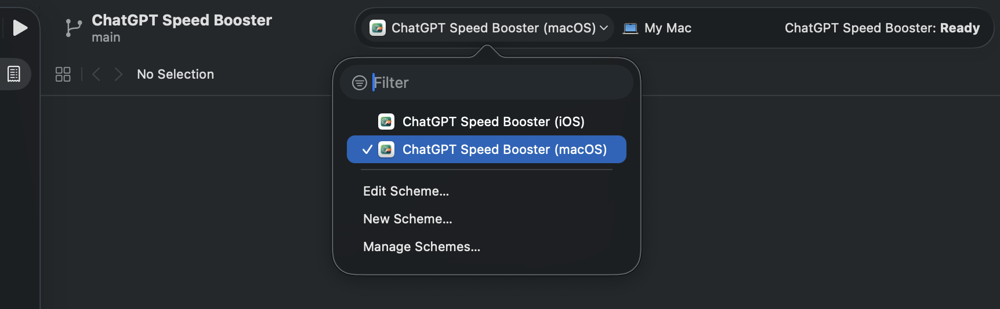
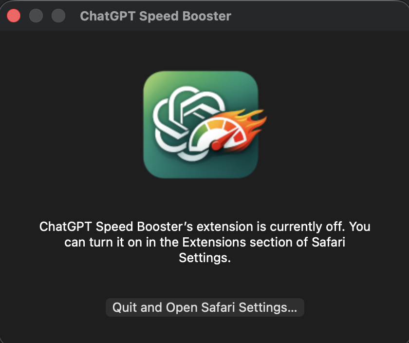

# ChatGPT Speed Booster

ChatGPT Speed Booster keeps long chats responsive by showing only recent messages first, then letting you load older ones when you need them.


## Build it yourself

### 1) Requirements

- Node.js 18+
- npm

### 2) Install

```bash
git clone https://github.com/Noah4ever/chatgpt-speed-booster.git
cd chatgpt-speed-booster
npm install
```

### 3) Build

Build all targets:

```bash
npm run build:all
```

You can also just build one target (`chrome`, `firefox`, `safari`, `edge`):

```bash
npm run build:chrome
```
Build ouput goes to `dist/chrome/`.

### 4) Load it in your browser

#### Chrome

1. Open `chrome://extensions`
3. Turn on Developer mode  (top right)
4. Click Load unpacked (top left)
5. Select `dist/chrome/`

#### Edge

1. Open `edge://extensions`
2. Turn on Developer mode
3. Click Load unpacked
4. Select `dist/edge/`

#### Firefox

1. Open `about:debugging#/runtime/this-firefox`
2. Click Load Temporary Add-on
3. Select `dist/firefox/manifest.json`

#### Safari

1. Build and generate the Xcode project:

```bash
npm run safari:setup
```

2. If it doesn't open automatically, open the Xcode project:

```bash
open "safari-app/ChatGPT Speed Booster/ChatGPT Speed Booster.xcodeproj"
```

3. In Xcode, select the **macOS app target** (not iOS, not extension target), then click **Run (▶)**.



After running, you may see a popup like this:



1. In Safari, open **Safari → Settings → Extensions** and enable **ChatGPT Speed Booster**.

If it appears but stays disabled:


Turn it on and allow it if Safari asks for permission.

1. Open `https://chatgpt.com` to verify it is active.
   You may have to allow it to run on that site if Safari prompts you. Maybe left of the address bar.

## How it works

- Shows the latest messages first (default: 10)
- Hides older messages
- Adds a Load more button at the top to reveal older messages in batches
- Keeps the visible window capped as new messages arrive

## Settings

Set these from the popup:

| Setting          | Default | Range |
| ---------------- | ------- | ----- |
| Visible messages | 10      | 1-200 |
| Load more batch  | 5       | 1-50  |

## Browser support

- Chrome
- Firefox
- Edge
- Safari

## Privacy

- No message content is read or sent anywhere
- No analytics or tracking
- Settings are stored locally in browser storage

## Source code submission (Firefox)

This project is built from TypeScript source files and bundled with esbuild.

### Build environment

- Operating systems: Linux, macOS, or Windows
- Node.js: 18 or newer
- npm: included with Node.js

### Reproducible build steps (Firefox)

```bash
git clone https://github.com/Noah4ever/chatgpt-speed-booster.git
cd chatgpt-speed-booster
npm ci
npm run build:firefox
```

The Firefox extension output is generated in `dist/firefox/`.
The file to load or package is `dist/firefox/manifest.json`.

Build script used by this project:

- `scripts/build.mjs`

## License

MIT
